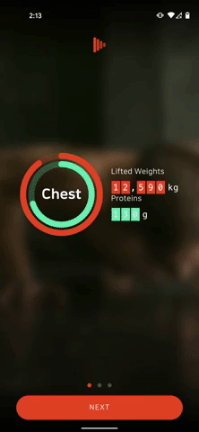
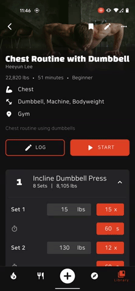
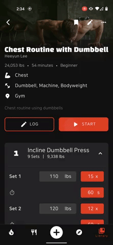
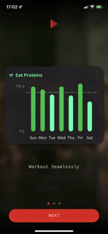
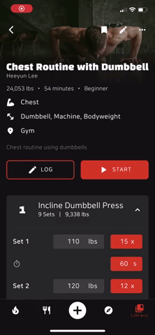
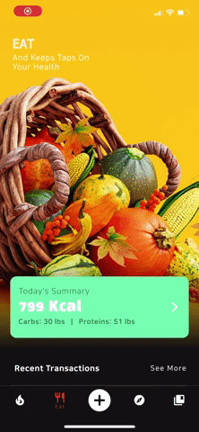

<h1 align="center">
  <a name="logo"></a>
  <br>
  <br>
  Break: Break Your Fitness Goals
  <br>
  <br>

  <a href="https://play.google.com/store/apps/details?id=com.healtine.playerh"></img></a>
  <a href="https://apps.apple.com/us/app/herakles-workout-player/id1555829140"></img></a>
</h1>

Break is a health & fitness tracking app built with Dart (Flutter) and Firebase. From logging nutritions to working out with YouTube videos, I have been learning and adding many cool features over the months, and here are some quick snippets.

<br>

### **Table of contents**
- [**Screenshots**](#screenshots)
- [**Introduction**](#introduction)
- [**Architecture**](#architecture)
- [**Features**](#features)
- [**Libraries**](#libraries)

<br>
<br>

## Screenshots

### Android

  Sign In & Preview Screen |   Routine Detail Screen   |     Workout Miniplayer    |        Speed Dial
:-------------------------:|:-------------------------:|:-------------------------:|:-------------------------:|
||| 

<br>

### iOS

  Sign In & Preview Screen |   Routine Detail Screen   |     Workout Miniplayer    |        Speed Dial
:-------------------------:|:-------------------------:|:-------------------------:|:-------------------------:|
||| 

<br>
<br>

## Introduction

### Why?
There are countless fitness apps available, yet I was never satisfied with just one app, and I always had to use multiple apps to log and track my physical activtivies—weightlifting and running—and nutrition consumption at the same time. For example, [Yazio] was very good for tracking nutritions consumptions, but tracking physical activities was never good there. [Strong] app was very good for tracking weight lifting exercises, but they didn't have the feautes to add nutritions consumptions. To achieve health & fitness goals such as dieting, both exercising AND eating are equally important, but no apps offered exceptionally good product for both.

That's why I started this project. The goal of this project is to create a all-in-one place for users to log and track their health & fitness. Users can log and track their body measurements, nutritions consumed, and workout data, and these data are transformed into customizable and easy-to-look dashboard, all in one app. 

This project is a work-in-process. I am keeping learning and developing new features. Below is the breif roadmap:

### Roadmap
#### Nutritions
- [x] Manaully add nutritions data
- [ ] Add nutritions by scanning bar code
- [ ] Automatically log nutritions data using credit card transactions data

#### Body Measurement
- [x] Manually add body measurements data
- [ ] Automatically sync measurements data with Apple HealthKit and/or Google Fit

#### Exercise
- [x] Log weight lifting exercise data manually
- [ ] Log other cardio workouts
- [x] Workout with YouTube Video


<br>
<br>

## Architecture
For this application, I've (sorted of) implemented the MVVM architecture pattern to increase maintainability and testability.

### Directory Structure
```
lib
│───models 
│   │───workout.dart
│   │───user.dart
│   │───routine.dart
│   │───nutrition.dart
│   │───measurement.dart
│   └───...
│───services
│   │───auth.dart
│   │───database.dart
│   │───firestore_service.dart
│   └───...
│───styles 
│   │───button_styles.dart
│   │───constants.dart
│   │───text_styles.dart
│   └───theme_colors.dart
│───utils
│   │───dummy_data.dart
│   └───formatter.dart
│───view
│   │───screens
│   │   │───animations
│   │   │───add_nutrition_screen.dart
│   │   │───add_workout_to_routine_screen.dart
│   │   │───...
│   │   │───library_tab.dart
│   │   │───preview_screen.dart
│   │   │───explore_tab.dart
│   │   └───...
│   └───widgets
│       │───...
│       │───builders
│       │   │───animated_list_view_builder.dart
│       │   │───custom_future_builder.dart
│       │   │───custom_list_view_builder.dart
│       │   └───custom_stream_builder.dart
│       │───buttons
│       │   │───appbar_back_button.dart
│       │   │───appbar_close_button.dart
│       │   │───keyboard_actions_done_button.dart
│       └───...
│───view_models
│   │───add_measurements_screen_model.dart
│   │───add_nutrition_screen_model.dart
│   │───add_workout_to_routine_screen_model.dart
│   └───...
└───main.dart   
```

<br>
<br>

## Features


### Workout Playlist


<br>
<br>

## Libraries
I have used the following libraries to build this app:

* [flutter_svg] for displaying svg files
* [logger] for better debugging and logging
* [uuid] for generating uuids
* [enum_to_string] to make working with enums easier
* [easy_localization] for easy i18n
* [email_validator] for validating emails
* [cached_network_image] for caching network images

* [cupertino_icons] for using iOS-looking icons
* [intl] for i18n
* [url_launcher] for launching url within the app
* [device_info_plus] for getting users' device info
* [flutter_lints] for strict Flutter Linting 
* [visibility_detector] for implementing visibility_detector
* [collection] to make working with collections easier
* [google_fonts] for using Google Fonts
* [flutter_blurhash] for creating pretty placeholder image using blurhash

* [firebase_storage] for Firebase Cloud Storage
* [firebase_core] to use Firebase
* [cloud_firestore] for Firebase Cloud Firestore
* [cloud_functions] for Firebase Cloud Functions
* [firebase_auth] for Firebase Authentication
* [firebase_crashlytics] for Firebase Crashlytics
* [firebase_analytics] for Firebase Analytics
  
* [google_sign_in] for enabling signing in with google with Firebase
* [flutter_facebook_auth] for enabling signing in with Facebook with Firebase
* [sign_in_with_apple] for enabling signing in with Apple
* [kakao_flutter_sdk] for enabling signing in with Kakao
  
* [provider] for state management
* [flutter_riverpod] for state management
* [get] for creating custom snackbar
* [rxdart] for streams (observables)
  
* [algolia] for search with Algolia
* [mixpanel_flutter] for using Mixpanel analytics
* [flutter_slidable] for implementing slidable list item
* [fl_chart] for creating aesthetic looking charts
* [smooth_page_indicator] for creating page indicators 
* [circular_countdown_timer] for countdown timer
* [keyboard_actions] for creating buttons on top of keyboards
* [flutter_rating_bar] for creating a sliding rating bar
* [confetti] for creating a confetti
* [numberpicker] for picking numbers
* [shimmer] for creating a loading widget that shimmer
* [miniplayer] for creating a miniplayer
* [percent_indicator] for creating a activity ring
* [table_calendar] for creating a table calendar
* [material_floating_search_bar] for creating a Google Map-like search bar
* [reorderables] for creating a reorderable list
* [dotted_border] for creating the dotted line
* [animated_text_kit] for creating animated text
* [youtube_plyr_iframe] for Youtube Player
* [timeago] for i18ned timeago messages
* [flutter_sticky_header] for creating Sticky header in Slivers

[cookbook]: https://flutter.dev/docs/cookbook/effects/staggered-menu-animation
[Yazio]: https://www.yazio.com/en
[Strong]: https://www.strong.app/
[flutter_svg]: https://pub.dev/packages/flutter_svg
[intl]: https://pub.dev/packages/intl
[logger]: https://pub.dev/packages/logger
[cupertino_icons]: https://pub.dev/packages/cupertino_icons
[url_launcher]: https://pub.dev/packages/url_launcher
[uuid]: https://pub.dev/packages/uuid
[collection]: https://pub.dev/packages/collection
[device_info_plus]: https://pub.dev/packages/device_info_plus
[enum_to_string]: https://pub.dev/packages/enum_to_string
[flutter_lints]: https://pub.dev/packages/flutter_lints
[firebase_storage]: https://pub.dev/packages/firebase_storage
[firebase_core]: https://pub.dev/packages/firebase_core
[cloud_firestore]: https://pub.dev/packages/cloud_firestore
[cloud_functions]: https://pub.dev/packages/cloud_firestore
[firebase_auth]: https://pub.dev/packages/firebase_auth
[firebase_crashlytics]: https://pub.dev/packages/firebase_crashlytics
[firebase_analytics]: https://pub.dev/packages/firebase_analytics
[google_fonts]: https://pub.dev/packages/google_fonts
[paginate_firestore]: https://pub.dev/packages/paginate_firestore
[google_sign_in]: https://pub.dev/packages?q=google_sign_in
[flutter_facebook_auth]: https://pub.dev/packages/flutter_facebook_auth
[sign_in_with_apple]: https://pub.dev/packages/sign_in_with_apple
[kakao_flutter_sdk]: https://pub.dev/packages/kakao_flutter_sdk
[provider]: https://pub.dev/packages/provider
[flutter_riverpod]: https://pub.dev/packages/flutter_riverpod
[get]: https://pub.dev/packages/get
[rxdart]: https://pub.dev/packages/rxdart
[flutter_slidable]: https://pub.dev/packages/flutter_slidable
[fl_chart]: https://pub.dev/packages/fl_chart
[smooth_page_indicator]: https://pub.dev/packages/smooth_page_indicator
[circular_countdown_timer]: https://pub.dev/packages/smooth_page_indicator
[keyboard_actions]: https://pub.dev/packages/keyboard_actions
[flutter_rating_bar]: https://pub.dev/packages/flutter_rating_bar
[confetti]: https://pub.dev/packages/confetti
[numberpicker]: https://pub.dev/packages/numberpicker
[shimmer]: https://pub.dev/packages/shimmer
[miniplayer]: https://pub.dev/packages/miniplayer
[percent_indicator]: https://pub.dev/packages/percent_indicator
[table_calendar]: https://pub.dev/packages/table_calendar
[material_floating_search_bar]: https://pub.dev/packages/material_floating_search_bar
[implicitly_animated_reorderable_list]: https://pub.dev/packages/implicitly_animated_reorderable_list
[reorderables]: https://pub.dev/packages/reorderables
[dotted_border]: https://pub.dev/packages/dotted_border
[animated_text_kit]: https://pub.dev/packages/animated_text_kit
[visibility_detector]: https://pub.dev/packages/visibility_detector
[youtube_plyr_iframe]: https://pub.dev/packages/youtube_plyr_iframe
[blurhash_dart]: https://pub.dev/packages/blurhash_dart
[cached_network_image]: https://pub.dev/packages/cached_network_image
[email_validator]: https://pub.dev/packages/email_validator
[timeago]: https://pub.dev/packages?q=timeago
[easy_localization]: https://pub.dev/packages/easy_localization
[flutter_blurhash]: https://pub.dev/packages/flutter_blurhash
[algolia]: https://pub.dev/packages/algolia
[mixpanel_flutter]: https://pub.dev/packages/mixpanel_flutter
[flutter_sticky_header]: https://pub.dev/packages/flutter_sticky_header