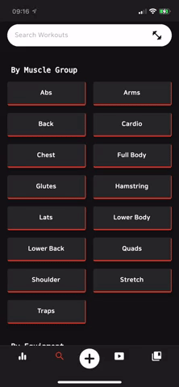
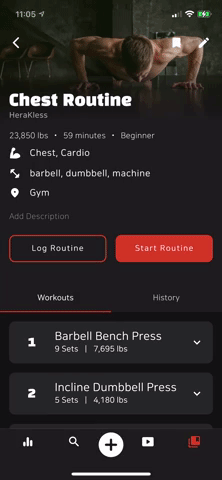
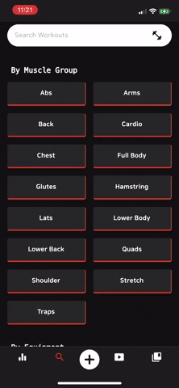
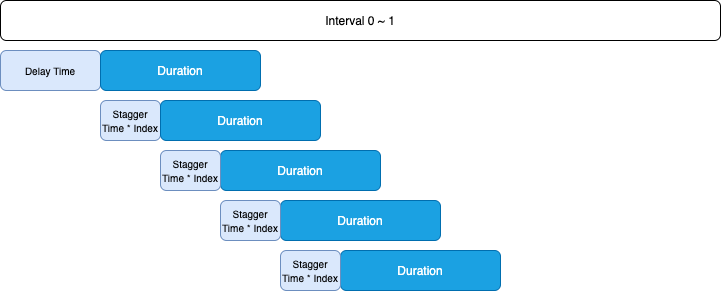
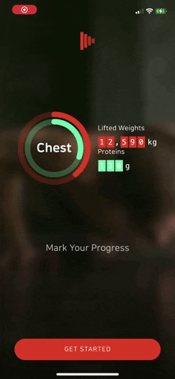
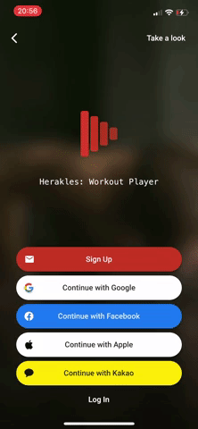
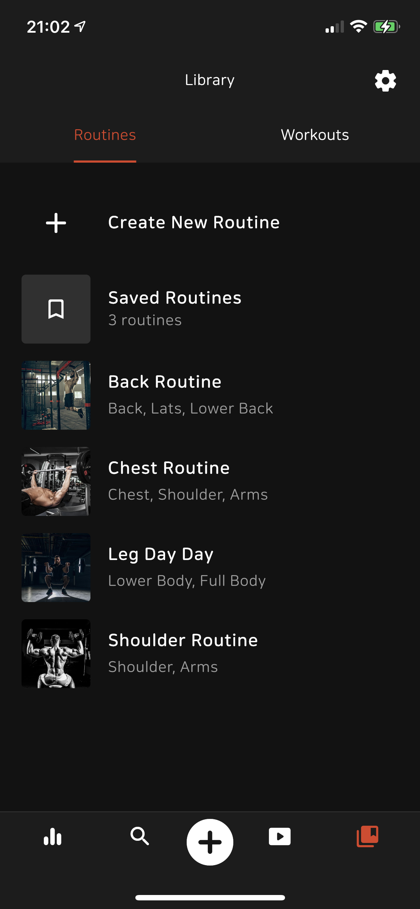
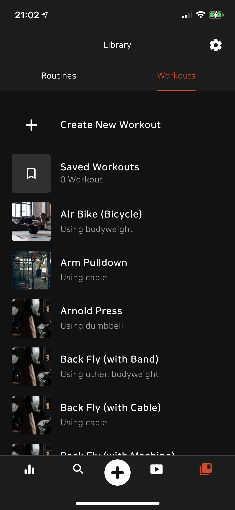
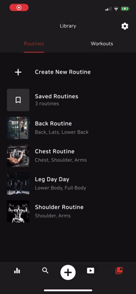

<h1 align="center">
  <a name="logo"></a>
  <br>
  <br>
  Herakles: Workout Player
  <br>
  <br>

  [](https://apps.apple.com/us/app/herakles-workout-player/id1555829140) [](https://play.google.com/store/apps/details?id=com.healtine.playerh)
</h1>

Herakles is a health & fitness tracking app built with Dart (Flutter) and Firebase. From logging nutritions to working out with YouTube videos, I have been learning and adding many cool features over the months, and here are some quick snippets.

<p align="left">
    
    &nbsp;
    &nbsp;
    &nbsp;
    
    &nbsp;
    &nbsp;
    &nbsp;
      
    &nbsp;
    &nbsp;
    &nbsp;
     
</p>

<br>
<br>

### **Table of contents**
- [**Introduction**](#introduction)
- [**Preview & Sign In Screen**](#preview--sign-in-screen)
- [**Library Tab**](#library-tab-workouts-and-workout-routines)
- [**To Do**](#to-do)

<br>
<br>

## Introduction

### Why?
There are countless fitness apps available, yet I was never satisfied with just one app, and I always had to use multiple apps to log and track my health & fitness. For example, [Yazio] was very good for tracking nutritions, but tracking physical activities was never good there. [Strong] app was very good for tracking weight lifting exercises, but it also lacked other functionalities. 

That's why I started this project. The goal of this project is to create a all-in-one place for users to log and track their health & fitness. Users can log their body measurements, nutritions consumed, and workout data, and these data are transformed into customizable and easy-to-look dashboard, all in one app. Users also can use YouTube videos to workout and log their progress.

### Checklist
- [x] Manaully add nutritions data
- [ ] Add nutritions by scanning bar code
- [ ] Automatically log nutritions data
- [x] Manually add body measurements data
- [ ] Automatically sync measurements data with Apple HealthKit and/or Google Fit
- [x] Log weight lifting exercise data
- [ ] Log other cardio workouts
- [x] Workout with YouTube Video


<br>
<br>

## Architecture
* MVVM

<br>
<br>

## Features

## Staggered Animation Transition


First, I created the custom widget with `FadeTransition()` and `SlideTransition()` so that each items could fade in/out or side up/down or in/out. 

Then, I created a custom `ListView.builder()` which delays each item's animation start time by `stagger time * index`.


<br>



```dart
return FadeTransition(
    opacity: opacityAnimation,
    child: SlideTransition(
    position: offsetTween.animate(offsetAnimation),
    child: child,
    ),
);
```

### Code Snippet
```dart
ListView.builder(
    padding: EdgeInsets.zero,
    itemCount: items.length,
    physics: const NeverScrollableScrollPhysics(),
    shrinkWrap: true,
    itemBuilder: (context, i) {
        // offsetBegin = 0.2 (offsetInitialDelayTime) + 0.1 (offsetStaggerTime) * i;
        final offsetBegin = 0.2 + 0.1 * i; 

        // offsetEnd = offsetBegin + 0.1 (offsetStaoffsetDurationggerTime);
        final offsetEnd = offsetBegin + 0.3!;

        assert(offsetEnd <= 1);

        return FadeSlideTransition(
            beginOffset: Offset(0.25, 0),
            endOffset: Offset(0, 0),
            offsetBeginInterval: offsetBegin,
            offsetEndInterval: offsetEnd,
            offsetCurves: Curves.decelerate,
            child: items[i],
        );
    },
);
```

## Preview & Sign In Screen
The preview screen showcases different widgets that users can use on the progress tab using `AnimatedSwitcher()` widget. On SingInScreen, I used Firebase Auth to authenticate users through email or different social sign-in providers, including `KakaoTalk`.  

For transitions between screens in PreviewScreen and SignInScreen, I made a reusable custom `PageRouteBuilder()` using `FadeTransition()` and `AnimatedBuilder()` to create staggered and fading animation effects that is showcased below. I used [cookbook] from official Flutter Doc as a reference to create this widget, but used `ListenableProvider()` to create more readable and reusable widget.

### Preview Screen & Transition Between Preview Screen and Sign In Screen
<p align="left">
    
    &nbsp;
    &nbsp;
    &nbsp;
    
    &nbsp;
    &nbsp;
    &nbsp;
      
    &nbsp;
    &nbsp;
    &nbsp;
     
</p>

<br>
<br>

## Library Tab: Workouts and Workout Routines
Library is a screen where user's custom-made/saved workouts and routines are displayed in a well-organized manner using `DefaultTabController()`, `NestedScrollView()`, and `TabBarView()`. UI is similiar to the 'library' of any music streaming apps that displays saved songs or playlists.

<p align="left">
    
    &nbsp;
    &nbsp;
    &nbsp;
    
</p>

<br>
<br>

### Routine Detail Screen


### Others screens from the library tab

<p align="left">
    
    &nbsp;
    &nbsp;
    &nbsp;
</p>

## Progress Tab
Progress tab displays various widgets that highlight user's health & fitness data.

<p align="left">
    
    &nbsp;
    &nbsp;
    &nbsp;
</p>

## Speed Dial

## Search Tab

## Settings Tab

## To Do
### Refactoring
#### This project is always-changing and always-improving. As I learn more about Flutter, and especially more about better factoring, I need to refactor old codes to make them better. Below are my refactoring to-do lists

#### Library Tab
- [x] `library_tab`
- [x] `routines_tab`
- [x] `workouts_tab`
- [x] `choose_title_screen`
- [x] `choose_equipment_required_screen`

#### Speed Dial
- [x] `add_measurements_screen`
- [x] `add_nutrition_screen`
- [x] ~~Start Workout Shortcut Screen~~ `choose_routine_screen`


- [ ] add_workout_to_routine_screen
- [x] Create Routine Screen
- [ ] Edit Routine Screen
- [ ] Log Routine Screen
- [ ] Routine History Tab
- [x] Routine Workout Card
- [ ] Workout Set Widget (half way done)
- [ ] Saved Routines Screen
- [x] Routine Detail Screen
- [ ] Create Workout Screen
- [ ] Edit Workout Screen
- [ ] Saved Workout Screen
- [ ] Workout Histories Tab
- [ ] Add Workout To Routine Screen
- [ ] Workout Detail Screen
- [ ] Measurements Screen
- [ ] Measurements Line Chart Widget
- [ ] Nutritions Screen
- [ ] Weekly Nutrition Chart
- [ ] Weights Lifted Chart Widget
- [ ] Search Tab
- [ ] Search Tab Body Widget
- [ ] Change Display Name Screen
- [ ] Change Email Screen
- [ ] Delete Account Screen
- [ ] Change Language Screen
- [ ] Unit Of Mass Screen
- [ ] User Feedback Screen
- [x] Home Screen
- [ ] SpeedDial
- [x] Preview Screen
- [ ] Miniplayer

## Libraries
I have used the following libraries to build this app:

* [flutter_svg] for displaying svg files
* [intl] for i18n
* [logger] for better debugging and logging
* [cupertino_icons] for using iOS-looking icons
* [url_launcher] for launching url within the app
* [uuid] for generating uuids
* [collection] to make working with collections easier
* [device_info_plus] for getting users' device info
* [enum_to_string] to make working with enums easier
* [flutter_lints] for strict Flutter Linting 
* [firebase_storage] for Firebase Cloud Storage
* [firebase_core] to use Firebase
* [cloud_firestore] for Firebase Cloud Firestore
* [cloud_functions] for Firebase Cloud Functions
* [firebase_auth] for Firebase Authentication
* [firebase_crashlytics] for Firebase Crashlytics
* [firebase_analytics] for Firebase Analytics
* [google_fonts] for using Google Fonts
* [paginate_firestore] for pagination and lazy loading
* [google_sign_in] for enabling signing in with google with Firebase
* [flutter_facebook_auth] for enabling signing in with Facebook with Firebase
* [sign_in_with_apple] for enabling signing in with Apple
* [kakao_flutter_sdk] for enabling signing in with Kakao
* [provider] for state management
* [flutter_riverpod] for state management
* [get] for creating custom snackbar
* [rxdart] for streams (observables)
* [flutter_slidable] for implementing slidable list item
* [fl_chart] for creating aesthetic looking charts
* [smooth_page_indicator] for creating page indicators 
* [circular_countdown_timer] for countdown timer
* [keyboard_actions] for creating buttons on top of keyboards
* [flutter_rating_bar] for creating a sliding rating bar
* [confetti] for creating a confetti
* [numberpicker] for picking numbers
* [shimmer] for creating a loading widget that shimmer
* [miniplayer] for creating a miniplayer
* [percent_indicator] for creating a activity ring
* [table_calendar] for creating a table calendar
* [material_floating_search_bar] for creating a Google Map-like search bar
* [implicitly_animated_reorderable_list] for creating implicitly animated list
* [reorderables] for creating a reorderable list
* [dotted_border] for creating the dotted line
* [animated_text_kit] for creating animated text
* [visibility_detector] for implementing visibility_detector
* [youtube_plyr_iframe] for Youtube Player
* [blurhash_dart] for creating blur has image
* [cached_network_image] for caching network images
* [email_validator] for validating emails
* [timeago] for i18ned timeago messages

[cookbook]: https://flutter.dev/docs/cookbook/effects/staggered-menu-animation
[Yazio]: https://www.yazio.com/en
[Strong]: https://www.strong.app/
[flutter_svg]: https://pub.dev/packages/flutter_svg
[intl]: https://pub.dev/packages/intl
[logger]: https://pub.dev/packages/logger
[cupertino_icons]: https://pub.dev/packages/cupertino_icons
[url_launcher]: https://pub.dev/packages/url_launcher
[uuid]: https://pub.dev/packages/uuid
[collection]: https://pub.dev/packages/collection
[device_info_plus]: https://pub.dev/packages/device_info_plus
[enum_to_string]: https://pub.dev/packages/enum_to_string
[flutter_lints]: https://pub.dev/packages/flutter_lints
[firebase_storage]: https://pub.dev/packages/firebase_storage
[firebase_core]: https://pub.dev/packages/firebase_core
[cloud_firestore]: https://pub.dev/packages/cloud_firestore
[cloud_functions]: https://pub.dev/packages/cloud_firestore
[firebase_auth]: https://pub.dev/packages/firebase_auth
[firebase_crashlytics]: https://pub.dev/packages/firebase_crashlytics
[firebase_analytics]: https://pub.dev/packages/firebase_analytics
[google_fonts]: https://pub.dev/packages/google_fonts
[paginate_firestore]: https://pub.dev/packages/paginate_firestore
[google_sign_in]: https://pub.dev/packages?q=google_sign_in
[flutter_facebook_auth]: https://pub.dev/packages/flutter_facebook_auth
[sign_in_with_apple]: https://pub.dev/packages/sign_in_with_apple
[kakao_flutter_sdk]: https://pub.dev/packages/kakao_flutter_sdk
[provider]: https://pub.dev/packages/provider
[flutter_riverpod]: https://pub.dev/packages/flutter_riverpod
[get]: https://pub.dev/packages/get
[rxdart]: https://pub.dev/packages/rxdart
[flutter_slidable]: https://pub.dev/packages/flutter_slidable
[fl_chart]: https://pub.dev/packages/fl_chart
[smooth_page_indicator]: https://pub.dev/packages/smooth_page_indicator
[circular_countdown_timer]: https://pub.dev/packages/smooth_page_indicator
[keyboard_actions]: https://pub.dev/packages/keyboard_actions
[flutter_rating_bar]: https://pub.dev/packages/flutter_rating_bar
[confetti]: https://pub.dev/packages/confetti
[numberpicker]: https://pub.dev/packages/numberpicker
[shimmer]: https://pub.dev/packages/shimmer
[miniplayer]: https://pub.dev/packages/miniplayer
[percent_indicator]: https://pub.dev/packages/percent_indicator
[table_calendar]: https://pub.dev/packages/table_calendar
[material_floating_search_bar]: https://pub.dev/packages/material_floating_search_bar
[implicitly_animated_reorderable_list]: https://pub.dev/packages/implicitly_animated_reorderable_list
[reorderables]: https://pub.dev/packages/reorderables
[dotted_border]: https://pub.dev/packages/dotted_border
[animated_text_kit]: https://pub.dev/packages/animated_text_kit
[visibility_detector]: https://pub.dev/packages/visibility_detector
[youtube_plyr_iframe]: https://pub.dev/packages/youtube_plyr_iframe
[blurhash_dart]: https://pub.dev/packages/blurhash_dart
[cached_network_image]: https://pub.dev/packages/cached_network_image
[email_validator]: https://pub.dev/packages/email_validator
[timeago]: https://pub.dev/packages?q=timeago