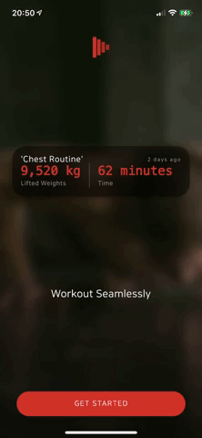

<h1 align="center">
  
   
   
  Herakles: Workout Player
   
   

   
</h1>

#### Herakles is health & fitness tracking app built with Flutter and Firebase. User can make a customizable dashboard to see their progress or use YouTbe-like miniplayer to workout in real time.
 
 

### **Table of contents**
- [**Introduction**](#introduction)
- [**Preview & Sign In Screen**](#preview--sign-in-screen)
- [**To Do**](#to-do)

 
 

## Introduction
Herakles is a health & fitness tracking app with customizable dashboard (with iOS-like widgets) and workout player (YouTube-like miniplayer and displays your current workout)

 
 

## Preview & Sign In Screen
The preview screen showcases different widgets that users can use on the progress tab using `AnimatedSwitcher()` widget. On SingInScreen, I used Firebase Auth to authenticate users through email or different social sign-in providers, including `Kakao`.  

For transition between PreviewScreen and SignInScreen, I made a custom `PageRouteBuilder()` and `AnimatedBuilder()` to create staggered animation effects for sign-in buttons and fading effects for all the other widgets.

### Preview Screen & Transition Between Preview Screen and Sign In Screen

    
    &nbsp;
    &nbsp;
    &nbsp;
    

## To Do
### Refactoring
#### This project is always-changing and always-improving. As I learn more about Flutter, and especially more about better factoring, I need to refactor old codes to make them better. Below are my refactoring to-do lists
- [x] Add Workout To Routine Screen
- [x] Create Routine Screen
- [ ] Edit Routine Screen
- [ ] Log Routine Screen
- [ ] Routine History Tab
- [x] Routine Workout Card
- [ ] Workout Set Widget (half way done)
- [ ] Saved Routines Screen
- [x] Routine Detail Screen
- [ ] Create Workout Screen
- [ ] Edit Workout Screen
- [ ] Saved Workout Screen
- [ ] Workout Histories Tab
- [ ] Add Workout To Routine Screen
- [ ] Workout Detail Screen
- [ ] Measurements Screen
- [ ] Measurements Line Chart Widget
- [ ] Nutritions Screen
- [ ] Weekly Nutrition Chart
- [ ] Weights Lifted Chart Widget
- [ ] Search Tab
- [ ] Search Tab Body Widget
- [ ] Change Display Name Screen
- [ ] Change Email Screen
- [ ] Delete Account Screen
- [ ] Change Language Screen
- [ ] Unit Of Mass Screen
- [ ] User Feedback Screen
- [x] Home Screen
- [x] Add Measurement Screen
- [x] Add Nutrition Screen
- [ ] Start Workout Shortcut Screen
- [ ] SpeedDial
- [x] Preview Screen
